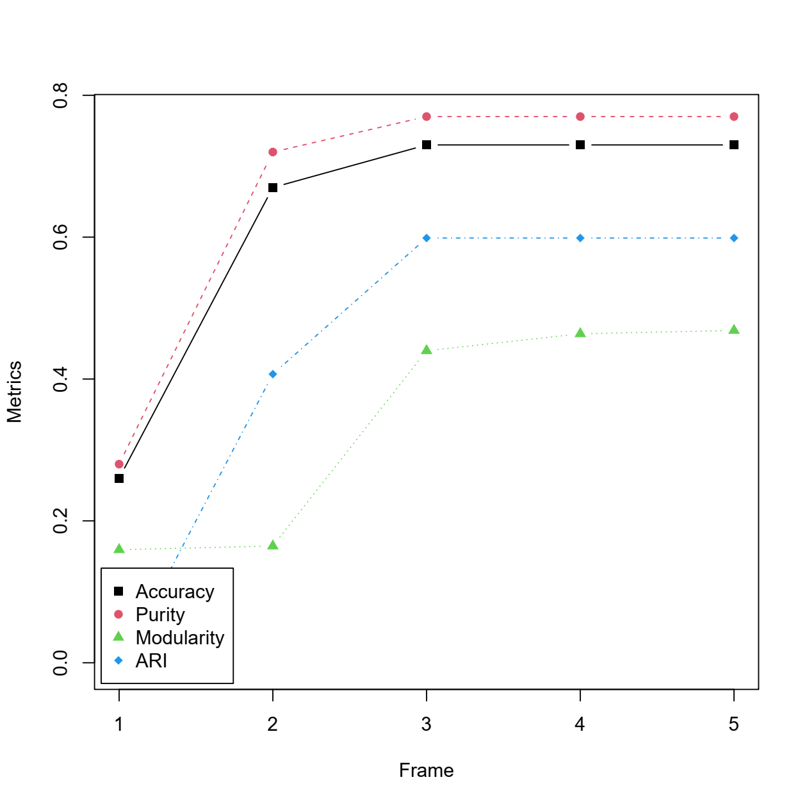

This repository contains the R code for k-component time-varying graph learning from data
with Student-t distribution applied to financial data clustering. 

## Installation in R

```r
> install.packages(spectralGraphTopology)
> devtools::install_github("javaheriamirhossein/k-tvgraph")
```

#### Microsoft Windows
On MS Windows environments, make sure to install the most recent version of ``Rtools``.


## Usage
Clone this repository to your local computer. Then run `demo_TVGL.R` or run the following code:

```r
library(fitHeavyTail)
library(xts)
library(quantmod)
library(igraph)
library(readr)
library(spectralGraphTopology)
library(combinat)

% import the time-varying graph learning package
library(tvgraph)


set.seed(42)

# number of stocks
p <- 100

# number of sectors (clusters)
q <- 8


# load SP500 stock prices_test into an xts table
stock_prices_orig <- readRDS("examples/stocks/sp500-data-2016-2020.rds")
stock_prices <- stock_prices_orig[1:1001,1:p]


# frame (window) length
winLen <-  200

Nday <- nrow(stock_prices)
Nwin <- Nday%/% winLen

# compute log-returns
log_returns <- diff(log(stock_prices), na.pad = FALSE)


# build network
SP500 <- read_csv("examples/stocks/SP500-sectors.csv")
stock_sectors <- SP500$GICS.Sector[SP500$Symbol %in% colnames(stock_prices)[1:p]]
stock_sectors_index <- as.numeric(as.factor(stock_sectors))


#----------------------------
## Online TV graph learning (proposed)
data_frame <- log_returns[1:winLen,]
S_cov <- cor(scale(data_frame))
w <- spectralGraphTopology:::w_init('naive', MASS::ginv(S_cov))
w0 <- w
A0 <- A(w)
A0 <- A0 / rowSums(A0)
w0 <- spectralGraphTopology:::Ainv(A0)
w0 = w0/sum(w0)

w_lagged <- w0

w_lagged <- 0

graphs_list <- vector("list", Nwin)


accuracy_adj_vec <- rep(0,Nwin)
purity_vec <- rep(0,Nwin)
mod_gt_vec <- rep(0,Nwin)
balanced_norm_vec <- rep(0,Nwin)
ARI_vec <- rep(0,Nwin)
GINI_vec <- rep(0,Nwin)
rank_mat <- rep(0,Nwin)


for (i in 1:Nwin){
  data_frame <- log_returns[((i-1)*winLen+1):(i*winLen),]
  nu <- fit_mvt(data_frame, nu = "MLE-diag-resampled")$nu
  graphs_list[[i]] <- learn_kcomp_heavytail_TV_graph_online(scale(data_frame), k = q, heavy_type = "student",
                                                     nu = nu,
                                                     sigma_e = exp(0.1),
                                                     w_lagged = w_lagged,
                                                     rho = 3,
                                                     d = 1,
                                                     w0 = w0,
                                                     update_eta = TRUE,
                                                     maxiter = 40,
                                                     verbose = TRUE)
  # ------------------------

  w <-  spectralGraphTopology:::Ainv(graphs_list[[i]]$adjacency)
  w_lagged <- w
  w0 <- w


  graph_net <- graph_from_adjacency_matrix(graphs_list[[i]]$adjacency, mode = "undirected", weighted = TRUE)

  # where do predictions differ from GICS?
  metric <- evaluate_clustering(graph_net, stock_sectors_index, p, q)

  accuracy_adj_vec[i] <- metric$accuracy_adj
  purity_vec[i] <- metric$purity
  mod_gt_vec[i] <- metric$mod_gt
  balanced_norm_vec[i] <- metric$balanced_norm
  GINI_vec[i] <- metric$GINI
  ARI_vec[i] <- metric$ARI
  rank_mat[i] <- Matrix::rankMatrix(graphs_list[[i]]$laplacian)[1]
}


Coords <- NULL
Ngraph <- length(graphs_list)

implied_clusters <- TRUE
for (id in c((Ngraph-2):1) ){
  gplt <- plot_graph(graphs_list[[id]]$laplacian, stock_sectors_index, colnames(stock_prices), Coords = Coords, 
                                 implied_clusters = implied_clusters )
  
  title(main =  paste("frame",id) )
  Coords <- gplt$Coords
}

```


Plot the clustering performance versus the frame number

```{r}
# print the final values of the clustering measures
cat("ACC: ", metric$accuracy_adj, "\n")
cat("PUR: ", metric$purity, "\n")
cat("MOD: ", metric$mod_gt, "\n")
cat("ARI: ", metric$ARI, "\n")


# Plot the clustering measures vs frames number
metrics <- matrix(rep(0,4*Nwin), Nwin, 4)
metrics[,1] <- accuracy_adj_vec
metrics[,2] <- purity_vec
metrics[,3] <- mod_gt_vec
metrics[,4] <- ARI_vec

matplot(metrics, type = "b",pch=2,col = 1:4, ylab = "Metrics", xlab = "Frame")
names <- c("Accuracy", "Purity", "Modularity", "ARI")
legend("bottomleft", inset=0.01, legend=names, col=c(1:4),pch=15:18,
       bg= ("white"), horiz=F)

```




## Citation
Please cite:

-   [A Javaheri](https://javaheriamirhossein.github.io/), [J Ying](https://jxying.github.io/),
    [DP Palomar](https://www.danielppalomar.com) and Farokh Matvasti
    [Time-Varying Graph Learning for Data with Heavy-Tailed Distribution](https://arxiv.org/abs/2501.00606),
    IEEE Transactions on Signal Processing, 2025.


